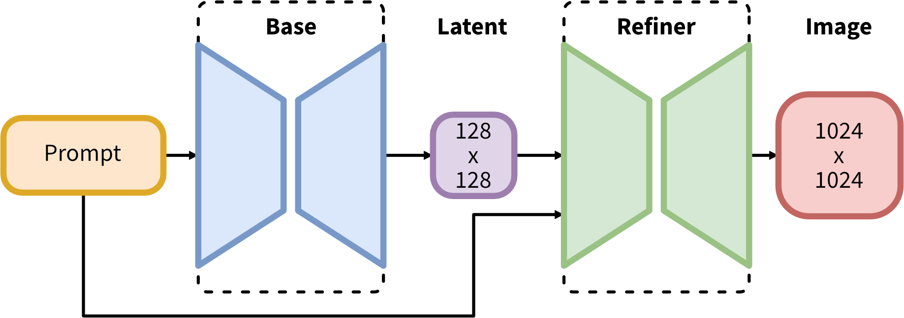

SDXL consists of an ensemble of experts pipeline for latent diffusion: In a first step, the base model is used to generate (noisy) latents, which are then further processed with a refinement model (available here: https://huggingface.co/stabilityai/stable-diffusion-xl-refiner-1.0/) specialized for the final denoising steps. Note that the base model can be used as a standalone module.

Alternatively, we can use a two-stage pipeline as follows: First, the base model is used to generate latents of the desired output size. In the second step, we use a specialized high-resolution model and apply a technique called SDEdit (https://arxiv.org/abs/2108.01073, also known as "img2img") to the latents generated in the first step, using the same prompt. This technique is slightly slower than the first one, as it requires more function evaluations.

https://huggingface.co/stabilityai/stable-diffusion-xl-base-1.0
30 min å laste modellen, og ca. 25 min å generere et bilde

https://huggingface.co/stabilityai/stable-diffusion-xl-refiner-1.0
