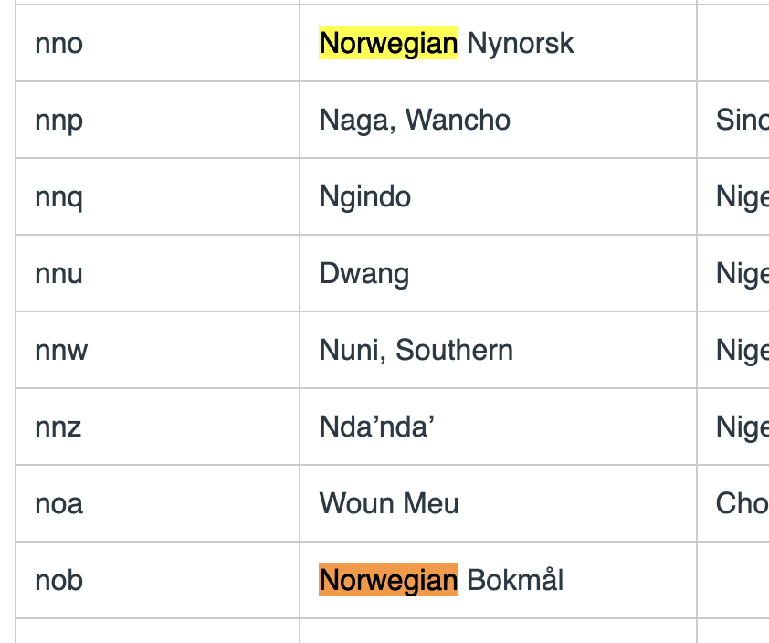

### text_to_speech

https://huggingface.co/models?pipeline_tag=text-to-speech

https://huggingface.co/versae/nb-nst-tts

https://huggingface.co/facebook/mms-tts-mam-dialect_northern
https://huggingface.co/facebook/mms-tts-quc-dialect_north

Facebook: 

Finner ingen modeller som klarer å gjøre om tekst til norsk tale. Sist sjekket var onsdag 27.desmber.

"ASR" typically stands for Automatic Speech Recognition. ASR technology is used to convert spoken language into text.

"TTS" stands for Text-to-Speech

Google sin model har kun ASR for bokmål og nynorsk. 